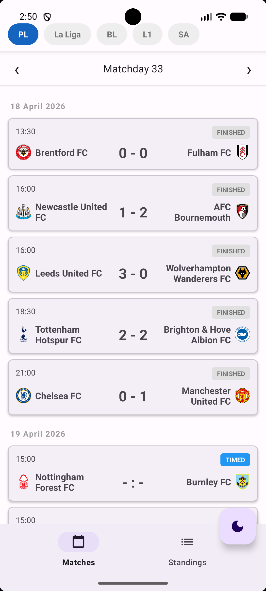
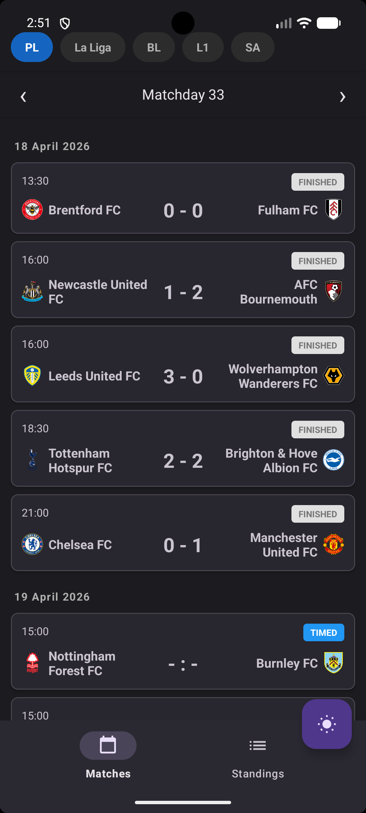
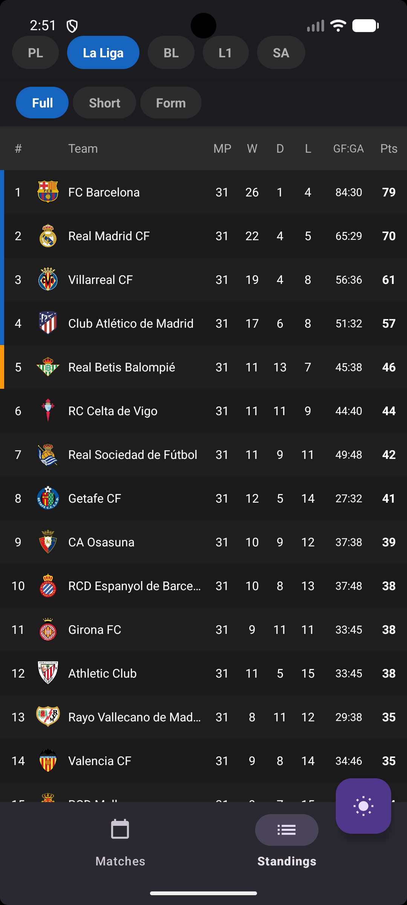
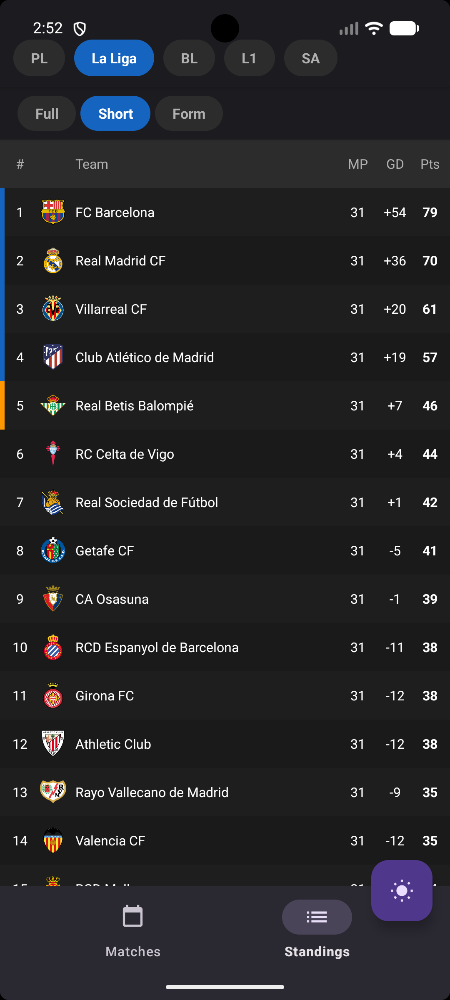
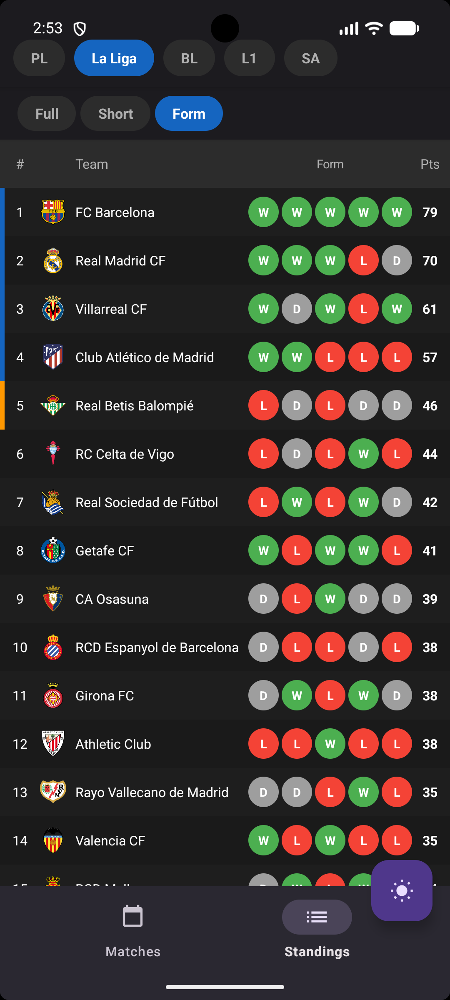
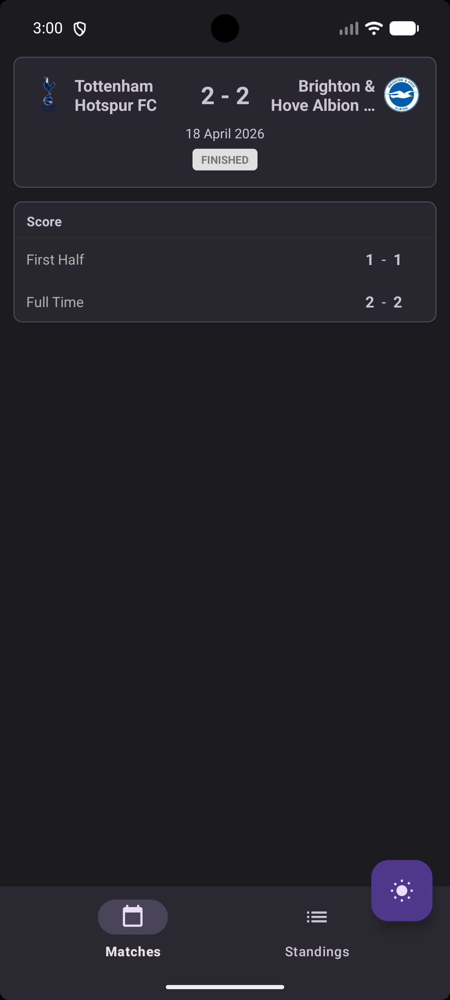
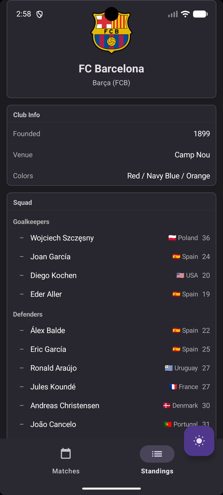

%# FootballPulse ⚽

An Android app for browsing football matches, standings, and team info across the **Top 5 European leagues** — built as a portfolio project.

## Screenshots

| Matches (Light) | Matches (Dark) | Standings — Full |
|---|---|---|
|  |  |  |

| Standings — Short | Standings — Form | Match Details |
|---|---|---|
|  |  |  |

| Team Details |
|---|---|---|
|  | .png) | .png) |

## Features

- Browse matches from **Premier League, La Liga, Bundesliga, Ligue 1, Serie A**
- Navigate matches by **matchday** — opens current matchday automatically
- Match cards grouped by date with **FINISHED / IN PLAY / TIMED** status badges
- **League standings** with 3 view modes:
  - **Full** — MP, W, D, L, GF:GA, Pts
  - **Short** — MP, GD, Pts
  - **Form** — last 5 matches as colored W/D/L badges
- **Match details** — first half and full time score breakdown
- **Team details** — club info (founded, venue, colors) + full squad grouped by position with nationality flag and age
- **Dark theme** support with persistent toggle
- Champions League / Europa League / Relegation zone color indicators in standings

## Tech Stack

- **Language:** Kotlin
- **Architecture:** MVVM (ViewModel + Repository + StateFlow)
- **Networking:** Retrofit2 + OkHttp
- **Async:** Kotlin Coroutines
- **Image loading:** Coil
- **UI:** Material Design 3, ViewBinding, RecyclerView
- **API:** [football-data.org](https://www.football-data.org/) (free tier)

## Architecture

The app follows MVVM pattern with a clean separation of layers:
- **UI layer** — Fragments + ViewBinding, observe StateFlow from ViewModel
- **ViewModel layer** — holds UI state, triggers data loading, exposes StateFlow
- **Repository layer** — single source of truth, maps DTOs to domain models
- **Data layer** — Retrofit API interface + DTOs with @SerializedName

## Getting Started

### Prerequisites
- Android Studio Hedgehog or newer
- Free API key from [football-data.org](https://www.football-data.org/)
- Min SDK 26

### Setup
1. Clone the repository:
```bash
   git clone https://github.com/artkorzh228/FootballPulse.git
```
2. Add your API key to `local.properties`:
FOOTBALL_API_KEY=your_key_here
3. Build and run on emulator or device

## Roadmap

- [ ] Player details screen
- [ ] Search functionality
- [ ] Favourite teams / matches
- [ ] Push notifications for live matches
- [ ] Jetpack Compose migration

## License

MIT
